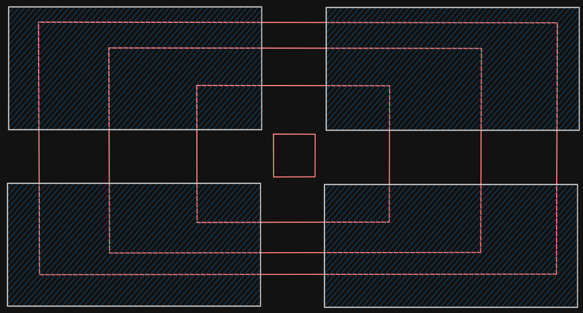
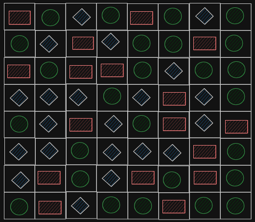

# class `Arena`:
<figure id="fig_1.1">
    
    <figcaption>Fig 1.1 - A screen shot of the game</figcaption>
</figure>

## Approach 
<figure id="fig_2.1"s>
    
    <figcaption>Fig 2.1 - Top Left corner of Arena</figcaption>
</figure>

There are 4 of such sections. 
The `player` cannot take turns while on these sections. 
Therefore, we can represent <a href="#fig_2.1">Fig 2.1</a> as `sf::Sprite`, a sprite class from [SFML](https://www.sfml-dev.org/) which will have the pink walls but transparent background.

<figure id="fig_2.2"s>
    
    <figcaption>Fig 2.2 - Arena corner being represented as a sprite</figcaption>
</figure>
<figure id="fig_2.3">
    
    <figcaption>Fig 2.3 - Arena corner being opaque</figcaption>
</figure>

Then we can display 4 of them, each one multiplied by `1` or `-1` with their `x` or `y` components to flip them.

<figure id="fig_2.4">
    
    <figcaption>Fig 2.4 - Arena corners</figcaption>
</figure>

The `player` can only take turns outside these sprites. 
We can use `intersects()` function from `sf::Sprite` class to check if player is inside these blocks or not. 
If not, then we allow `player` to take turns. 
Otherwise inputs will be ignored. 

<figure id="fig_2.5">
    
    <figcaption>Fig 2.5 - Tracks</figcaption>
</figure>

`Player` can move onto these 4 `tracks`. 
Each one will have 4 ordered pairs (coordinates for each corner). 
Structure might look something like:
```cpp
struct track {
    sf::Vector2i corners[4];
};
```
They will be set by `Arena constructor` based on the dimensions of it. 

### Prototype:
```cpp
class Arena {
    public:
        Arena();
        ~Arena();

        void populateFoodMap();

        void initialize(sf::RenderWindow& target_w);
        void render(sf::RenderWindow& target_w);
        void foodConsumption(Player& player, int& scores, Opponent& Opponent, sf::Clock& ticks);
        void foodDistribution();

        int getFoodLeft();
        void setFoodLeft(int value);

        Track* getTrack(int index);
        sf::Sprite* getArenaTile(int index);

    private:
        int foodLeft = 8 * 8;
        sf::Texture cornerTexture, centerTexture;
        sf::Sprite arenaTiles[5];
        sf::Vector2f spriteSize[2];

        sf::Vector2f cornerScale = {0.5, 0.5};
        sf::Vector2f centerScale = {0.25, 0.25};

        Track ring[4];

        FoodItem* foodMap[8][8];
};
```
Now let's explain all components one by one. First, we will talk about the `private` attributes.
```cpp
int foodLeft = 8 * 8;
```
As the name suggests, `foodLeft` keeps track of how many food items are remaining currently.

```cpp
sf::Texture cornerTexture, centerTexture;
sf::Sprite arenaTiles[5];
```
As there are five tiles in the whole arena where 4 of them are exactly the same, but are just flipped. So the there is `cornerTexture` for them and `centerTexture` for the tile in the middle.

```cpp
sf::Vector2f spriteSize[2];
```
The first size, `spriteSize[0]` is used for corners. Meanwhile, the other one, `spriteSize[1]` is used for the center tile.

```cpp
sf::Vector2f cornerScale = {0.5, 0.5};
sf::Vector2f centerScale = {0.25, 0.25};
```
As the name suggests, these are `scalar vectors` used for only resizing purposes.

```cpp
Track ring[4];
```
The four `tracks` on which player and opponent move.

```cpp
FoodItem* foodMap[8][8];
```

The `Arena` will also contain [food](./food.md) items. 
They are tracked by a 2-dimensional array called `foodMap`.  
If we look at <a href="#fig_1.1">Fig 1.1</a>, we can think of the `tracks` as `rings` where `ring 0` represents the inner most `track`. 
Let `ring number` be represented by `r` then for each `ring`, number of `food` items is: 
$$\left( 4 + 8r \right)$$

The total amount of food on the map is represented by equation:
$$\sum_{r = 0}^3 \left(4 + 8r\right)$$
Since the `foodMap` is in shape of a `square`, the dimensions are `m*m` where `m` is the `sqrt` of this result. 
```cpp
FoodItem* foodMap[8][8] = {0};
```
The constructor will iterate over this `map` and create `rand()` based food object and the address of it is stored in the grid.
Then this grid can be utilized inside `foodEaten(Player&)` function.

<figure>
    
    <figcaption>Fig 3.1 - Example of <code>foodMap</code> in memory</figcaption>
</figure>

Now let's explain the interface, the `public` functions. But first, let's get the `getter` and `setter` functions out of the way.
```cpp
int Arena::getFoodLeft() {
    return foodLeft;
}

void Arena::setFoodLeft(int value) {
    foodLeft = value;
}

Track* Arena::getTrack(int index) {
    return &ring[index];
}

sf::Sprite* Arena::getArenaTile(int index) {
    return &arenaTiles[index];
}
```

Let's continue our discussion with the rest of the interfaces of the class.

### Constructor
The constructor loads the texture images.
```cpp
cornerTexture.loadFromFile("../assets/img/arena/arenaTileCorner.png");
centerTexture.loadFromFile("../assets/img/arena/arenaTileCenter.png");
```
Sets them to the sprite, which are scaled.
```cpp
for (int i = 0; i < 4; i++) {
    arenaTiles[i].setTexture(cornerTexture);
    arenaTiles[i].setScale(cornerScale);
}

arenaTiles[4].setTexture(centerTexture);
arenaTiles[4].setScale(centerScale);
```
And then lastly, calls `populateFoodMap()` to spawn fooditems throughout the whole arena.
```cpp
populateFoodMap();
```
The whole constructor looks like this:
```cpp
Arena::Arena() {

    cornerTexture.loadFromFile("../assets/img/arena/arenaTileCorner.png");
    centerTexture.loadFromFile("../assets/img/arena/arenaTileCenter.png");

    for (int i = 0; i < 4; i++) {
        arenaTiles[i].setTexture(cornerTexture);
        arenaTiles[i].setScale(cornerScale);
    }

    arenaTiles[4].setTexture(centerTexture);
    arenaTiles[4].setScale(centerScale);

    populateFoodMap();

}
```

### Destructor
The `destructor` just frees up the memory allocated for the `foodMap`.
```cpp
Arena::~Arena() {
    for (int j = 0; j < 8; j++) {
        for (int z = 0; z < 8; z++) {
            delete foodMap[j][z];
        }
    }
}
```

### populateFoodMap
This function uses `srand()` to set the seed for random number generator.
```cpp
srand(time(0));
```
then we loop over the grid.
```cpp
for (int j = 0; j < 8; j++) {
    for (int z = 0; z < 8; z++) {

    }
}
```
Use a `switch` to check random number from `0` to `3` and generate food accordinly.
```cpp
int magicNum = rand() % 4;
            
switch (magicNum) {
    case 0:
        foodMap[j][z] = new Rect(sf::Vector2f(40, 20));
        break;
    case 1:
        foodMap[j][z] = new Cir(10);
        break;
    case 2:
        foodMap[j][z] = new Hex(10);
        break;
    case 3:
        foodMap[j][z] = new Tri(10);
        break;
    default:
        break;
}
```
The whole function looks like this:
```cpp
void Arena::populateFoodMap() {
    srand(time(0));

    for (int j = 0; j < 8; j++) {
        for (int z = 0; z < 8; z++) {

            int magicNum = rand() % 4;
            
            switch (magicNum) {
                case 0:
                    foodMap[j][z] = new Rect(sf::Vector2f(40, 20));
                    break;
                case 1:
                    foodMap[j][z] = new Cir(10);
                    break;
                case 2:
                    foodMap[j][z] = new Hex(10);
                    break;
                case 3:
                    foodMap[j][z] = new Tri(10);
                    break;
                default:
                    break;
            }
        }
    }
}
```

### initialize
First we track the sizes of the tiles in pixels.
```cpp
spriteSize[0] = {
    arenaTiles[0].getGlobalBounds().width,
    arenaTiles[0].getGlobalBounds().height
};
```
Figure out `padding` around the corners. (`gap` is another variable which stores the gap between each tile in pixels)
```cpp
sf::Vector2f padding = {
    (target_w.getSize().x - (gap + 2 * spriteSize[0].x)) / 2,
    (target_w.getSize().y - (gap + 2 * spriteSize[0].y)) / 2
};
```
Then we can loop over them and set their `origin` to center.
```cpp
arenaTiles[i].setOrigin(
    cornerTexture.getSize().x / 2,
    cornerTexture.getSize().y / 2
);
```
Also set their scale (for correct flipping).
```cpp
arenaTiles[i].scale(
    (i % 2) ? -1 : 1,
    (i / 2) ? -1 : 1
);
```
And there position.
```cpp
arenaTiles[i].setPosition(
    (spriteSize[0].x / 2 + padding.x) + 
    (i % 2) * (spriteSize[0].x + gap),

    (spriteSize[0].y / 2 + padding.y)+ 
    (i / 2) * (spriteSize[0].y + gap)
);
```
We can do same for the center tile but it will be more simpler since it exists right at center of the window.
```cpp
arenaTiles[4].setOrigin(
    centerTexture.getSize().x / 2,
    centerTexture.getSize().y / 2
);

spriteSize[1] = {
    arenaTiles[4].getGlobalBounds().width,
    arenaTiles[4].getGlobalBounds().height
};

arenaTiles[4].setPosition(
    target_w.getSize().x / 2,
    target_w.getSize().y / 2
);
```
Then we can do some math to figure out where the tracks need to be at:
```cpp
float wallThickness = cornerScale.x * 56;
float roadSize =  cornerScale.x * 69;
float roadMid = (wallThickness * 2 + roadSize) / 2;

sf::Vector2f trackPointer = {roadMid + padding.x, roadMid + padding.y};

for (int j = 0; j < 4; j++) {
    ring[j].initialize(trackPointer, target_w);
    trackPointer += sf::Vector2f(wallThickness + roadSize, wallThickness + roadSize);
}
```
and lastly, call a function to fix position of those foodItems we had spawned.
```cpp
foodDistribution();
```
The whole implementation looks something like:
```cpp
void Arena::initialize(sf::RenderWindow& target_w) {
    
    int gap = 150;

    //since all the corner tiles have same dimensions and same scales
    spriteSize[0] = {
        arenaTiles[0].getGlobalBounds().width,
        arenaTiles[0].getGlobalBounds().height
    };

    sf::Vector2f padding = {
        (target_w.getSize().x - (gap + 2 * spriteSize[0].x)) / 2,
        (target_w.getSize().y - (gap + 2 * spriteSize[0].y)) / 2
    };

    for (int i = 0; i < 4; i++) {

        arenaTiles[i].setOrigin(
            cornerTexture.getSize().x / 2,
            cornerTexture.getSize().y / 2
        );

        //relative to current scale
        arenaTiles[i].scale(
            (i % 2) ? -1 : 1,
            (i / 2) ? -1 : 1
        );

        arenaTiles[i].setPosition(
            (spriteSize[0].x / 2 + padding.x) + 
            (i % 2) * (spriteSize[0].x + gap),

            (spriteSize[0].y / 2 + padding.y)+ 
            (i / 2) * (spriteSize[0].y + gap)
        );

    }

    arenaTiles[4].setOrigin(
        centerTexture.getSize().x / 2,
        centerTexture.getSize().y / 2
    );

    spriteSize[1] = {
        arenaTiles[4].getGlobalBounds().width,
        arenaTiles[4].getGlobalBounds().height
    };

    arenaTiles[4].setPosition(
        target_w.getSize().x / 2,
        target_w.getSize().y / 2
    );

    float wallThickness = cornerScale.x * 56;
    float roadSize =  cornerScale.x * 69;
    float roadMid = (wallThickness * 2 + roadSize) / 2;
    
    sf::Vector2f trackPointer = {roadMid + padding.x, roadMid + padding.y};

    for (int j = 0; j < 4; j++) {
        ring[j].initialize(trackPointer, target_w);
        trackPointer += sf::Vector2f(wallThickness + roadSize, wallThickness + roadSize);
    }

    foodDistribution();

}
```

### render
We can `render` the five tiles.
```cpp
for (int i = 0; i < 5; i++) {
    target_w.draw(arenaTiles[i]);
}
```
and the foodItems themselves.
```cpp
for (int j = 0; j < 8; j++) {
    for (int z = 0; z < 8; z++) {
        if (foodMap[j][z] != nullptr)
            foodMap[j][z]->render(target_w, foodMap[j][z]->getAppearance());
    }
}
```
That is what the `render` function does.
```cpp
void Arena::render(sf::RenderWindow& target_w) {
    for (int i = 0; i < 5; i++) {
        target_w.draw(arenaTiles[i]);
    }

    for (int j = 0; j < 8; j++) {
        for (int z = 0; z < 8; z++) {
            if (foodMap[j][z] != nullptr)
                foodMap[j][z]->render(target_w, foodMap[j][z]->getAppearance());
        }
    }
}
```

### foodConsumption
We will interate through the entire `foodMap`.
```cpp
for (int i = 0; i < 8; i++) {
    for (int z = 0; z < 8; z++) {

    }
}
```
Check if the `player` collides with the current foodItem being checked.
```cpp
if (
    foodMap[i][z] == nullptr || 
    !foodMap[i][z]->collides(player, foodMap[i][z]->getAppearance())
)
    continue;
```
Otherwise, reset the `clock`, give `player` the perks, delete that foodItem, set its pointer to `nullptr` and decrease the foodLeft count.

```cpp
ticks.restart();
foodMap[i][z]->givePerk(player, scores, Opponent);
delete foodMap[i][z];
foodMap[i][z] = nullptr;
foodLeft--;
```
All of that combined looks something like this.
```cpp
void Arena::foodConsumption(Player& player, int& scores, Opponent& Opponent, sf::Clock& ticks) {
    for (int i = 0; i < 8; i++) {
        for (int z = 0; z < 8; z++) {
            if (
                foodMap[i][z] == nullptr || 
                !foodMap[i][z]->collides(player, foodMap[i][z]->getAppearance())
            ) 
                continue;
            
            ticks.restart();

            foodMap[i][z]->givePerk(player, scores, Opponent);
            delete foodMap[i][z];
            foodMap[i][z] = nullptr;
            foodLeft--;
        }
    }
}
```

### foodDistribution
We will distribute the food by iterating over the `tracks`.
```cpp
for (int i = 0; i < 4; i++) {

}
```
Figure out how much food is in each `track` according to `track` number (indicated by `i`).
```cpp
int foodCount = 28 - (8 * i);
```
Get corner coordinates of current `track`.
```cpp
sf::Vector2f* corner = ring[i].getCorners();
```
Figuring out spacing between each foodItem.
```cpp
sf::Vector2f spacing = {
    (corner[1].x - corner[0].x - gap) / (foodCount / 4),
    (corner[2].y - corner[1].y - gap) / (foodCount / 4)
};
```
We can use a `vector` to keep track of which foodItem is being distributed.
```cpp
sf::Vector2i foodIndex = {0, 0};
```
Then we can iterate over the height of the current `track`. Starting of the loop is same as `i` which acts as starting offset inside the `foodMap` array. Same offset will also have to be added to the number of foodItems in that length (tracked by `foodPerSide`).
```cpp
for (int j = i; j < foodPerSide + i; j++) {
    int z = i;

    //distribution loop goes here

    foodIndex.x = 0;    //reset column position
    foodIndex.y++;      //increase row position
}
```
Since the array is in shape of a _square_ so we can use `z` as index for columns, set equal to `i`, the offset and it works because of the symmetric property of _squares_.  
The optional `gap` between the tiles is handled by
```cpp
((x > 3) ? gap : 0)
```
where `x` can be either row or column index
```cpp
while (z < foodPerSide + i) {
    foodMap[j][z]->setPosition(sf::Vector2f(
        corner[0].x + spacing.x * foodIndex.x + ((z > 3) ? gap : 0),
        corner[0].y + spacing.y * foodIndex.y + ((j > 3) ? gap : 0)
    ));

    foodMap[j][z]->update(foodMap[j][z]->getAppearance());

    if ((j == i || j == foodPerSide - 1 + i)){
        foodIndex.x++;
        z++;
    }
    else {
        foodIndex.x += foodPerSide - 1;
        z += foodPerSide - 1;
    }
}
```
The whole function looks something like:
```cpp
void Arena::foodDistribution() {

    int gap = 150;

    for (int i = 0; i < 4; i++) {

        int foodCount = 28 - (8 * i);

        sf::Vector2f* corner = ring[i].getCorners();

        sf::Vector2f spacing = {
            (corner[1].x - corner[0].x - gap) / (foodCount / 4),
            (corner[2].y - corner[1].y - gap) / (foodCount / 4)
        };

        int foodPerSide = (foodCount / 4) + 1;

        sf::Vector2i foodIndex = {0, 0};

        //food distribution
        for (int j = i; j < foodPerSide + i; j++) {
            
            int z = i;

            while (z < foodPerSide + i) {
                foodMap[j][z]->setPosition(sf::Vector2f(
                    corner[0].x + spacing.x * foodIndex.x + ((z > 3) ? gap : 0),
                    corner[0].y + spacing.y * foodIndex.y + ((j > 3) ? gap : 0)
                ));

                foodMap[j][z]->update(foodMap[j][z]->getAppearance());

                if ((j == i || j == foodPerSide - 1 + i)){
                    foodIndex.x++;
                    z++;
                }
                else {
                    foodIndex.x += foodPerSide - 1;
                    z += foodPerSide - 1;
                }
            }

            foodIndex.x = 0;
            foodIndex.y++;
        }
    }
}
```