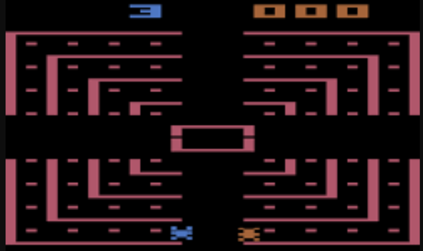
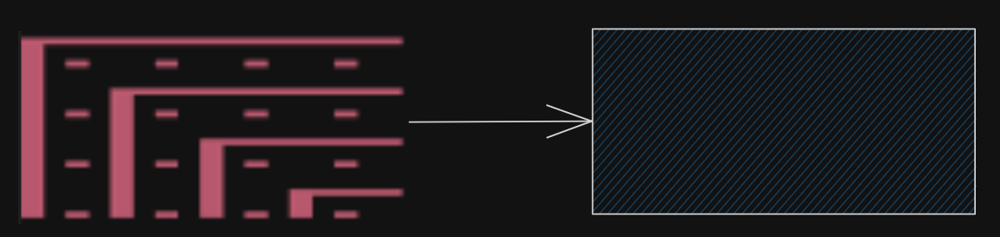
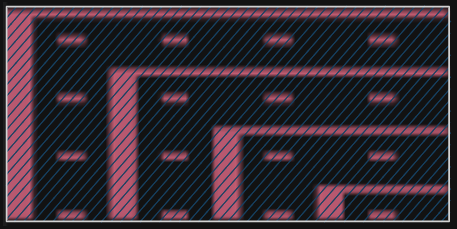
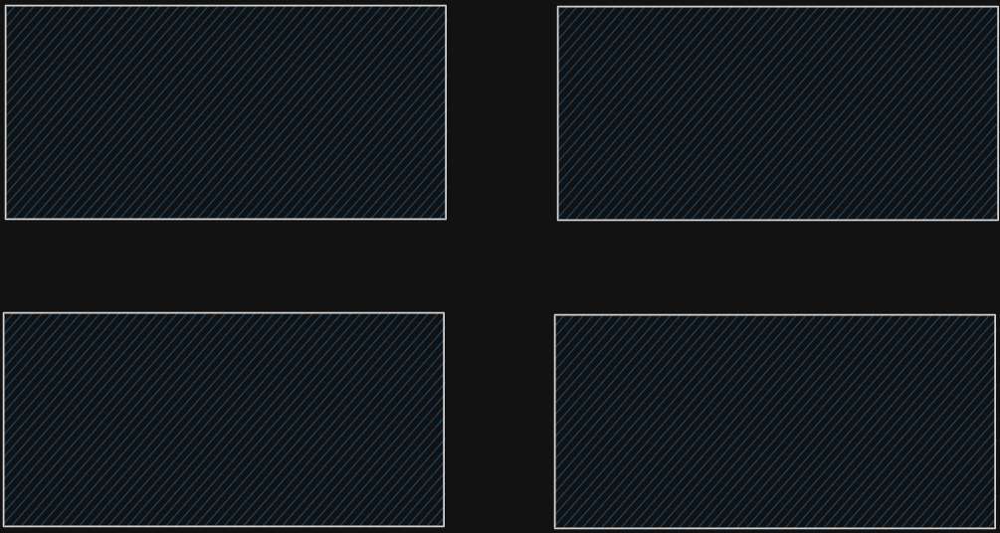

# class `Arena`:
<figure id="fig_1.1">
    
    <figcaption>Fig 1.1 - A screen shot of the game</figcaption>
</figure>

## Approach 
<figure id="fig_2.1"s>
    
    <figcaption>Fig 2.1 - Top Left corner of Arena</figcaption>
</figure>

There are 4 of such sections. 
The `player` cannot take turns while on these sections. 
Therefore, we can represent <a href="#fig_2.1">Fig 2.1</a> as `sf::Sprite`, a sprite class from [SFML](https://www.sfml-dev.org/) which will have the pink walls but transparent background.

<figure id="fig_2.2"s>
    
    <figcaption>Fig 2.2 - Arena corner being represented as a sprite</figcaption>
</figure>
<figure id="fig_2.3"s>
    
    <figcaption>Fig 2.3 - Arena corner being opaque</figcaption>
</figure>

Then we can display 4 of them, each one multiplied by `1` or `-1` with their `x` or `y` components to flip them.

<figure id="fig_2.4">
    
    <figcaption>Fig 2.4 - Arena corners</figcaption>
</figure>